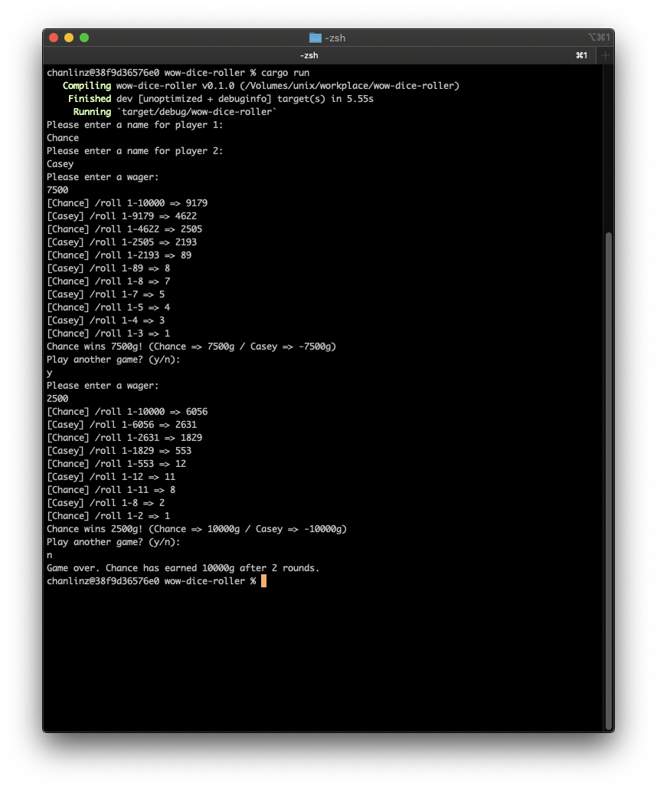

## Overview
There's a Lua command you can run within World of Warcraft: `/roll`. This was used historically for allowing players to fairly roll on an item that dropped. Loot systems in the game have evolved over time and the `/roll` command is largely no longer necessary for loot distribution within the game. It mainly sees usage today in the form of "dice rolling" which is a way for degenerates like me to gamble away their hard-earned gold.

## How to dice roll
Dice rolling is relatively straightforward:
  - The participants agree on an amount to wager before rolling
  - One player rolls the initial roll from 1 to 10000 (or any arbitrary number, it doesn't particularly matter).
  - The following player rolls between 1 and the previous player's roll.
  - Players continue rolling until one player rolls a 1. This player is the **winner**.
  - All players pay the winning player the amount of money agreed upon before the match.

## What this application does
This application sets up a game of dice rolling between two players. Each round the players wager an amount and then the dice roll happens automatically. At the end of the round, players are asked whether they want to continue or whether they'd like to cash out. 

## Demo

